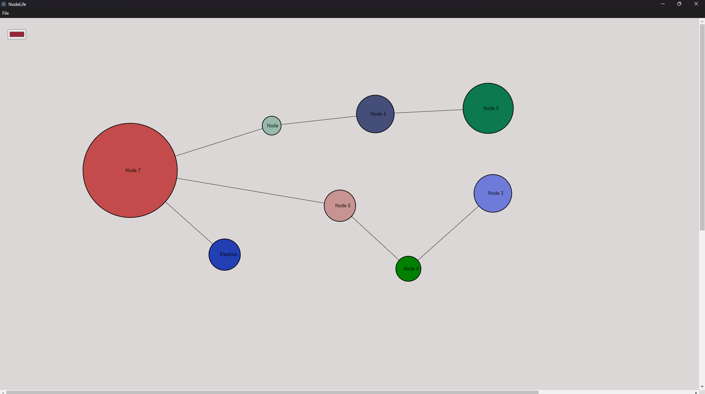
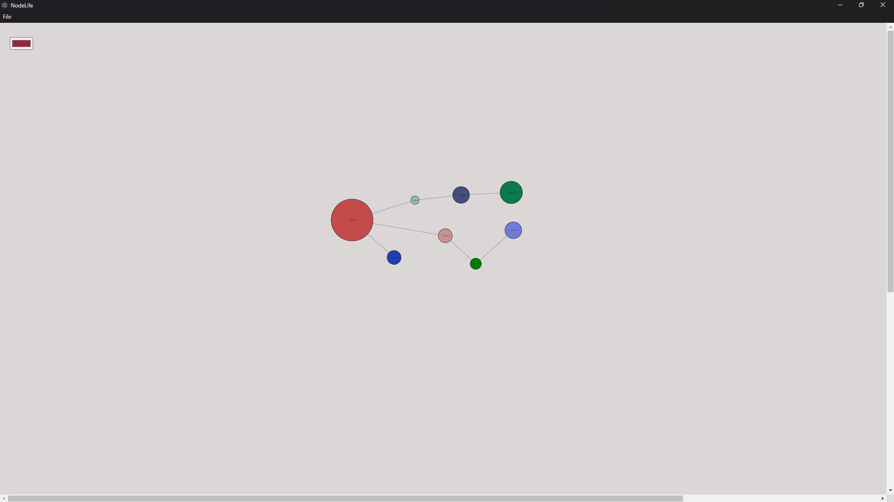
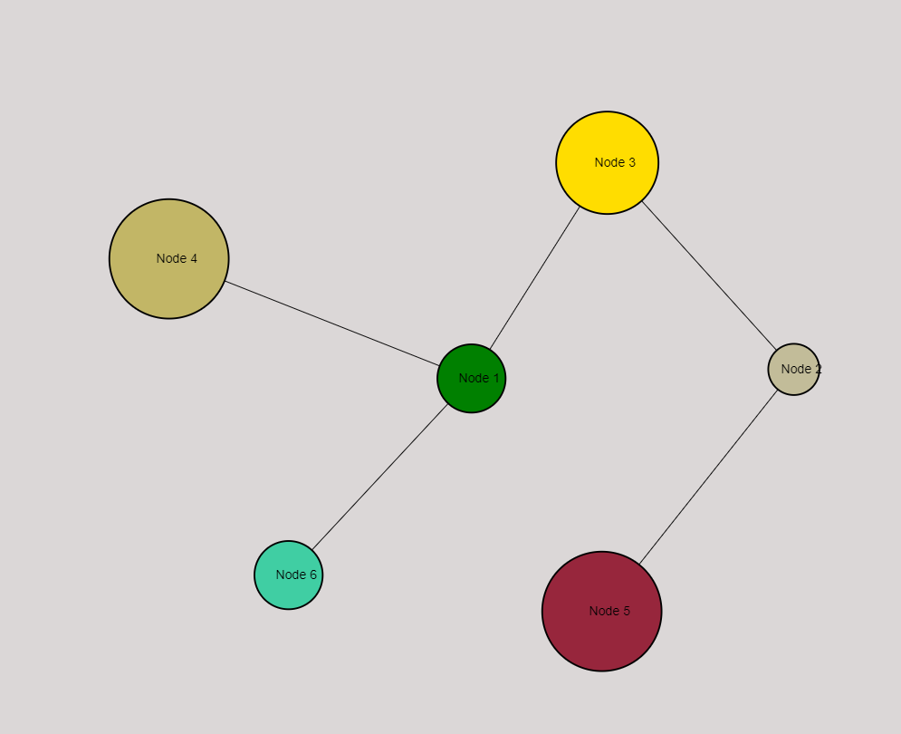
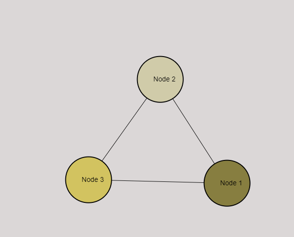

# Relata
**Relata** is an app built with **Electron** for note-taking, brainstorm and map relationships on a graph with a node-like structure

## 🚀 Version 1.0.0 Release
**Relata** (v1.0.0) releases with all intended core functionalities and most (known) bugs fixed

## ⚠️ Security Disclaimer

**Important Notice:**
This application currently has known security issues that I was unable to fix before release. If you are concerned about security risks, please use it with caution.

- Running untrusted files/scripts inside the app may pose a risk.
- Avoid using it with sensitive or personal data.
- I plan to address these issues in future updates.

If you have suggestions or solutions, feel free to contribute!

## 📥 Download

You can download the latest release from the [Releases](https://github.com/yourusername/myelectronapp/releases) section.

## 🛠 Installation

1. Download zip / clone
2. run `npm install` for dependencies
3. run `npm electron .`

# for stand-alone

1. Download the installer for your OS.
2. Run the installer and follow the on-screen instructions.
3. Launch **Relata**

## Hotkeys

- (**n**) create a new node
- (**d**) delete selected node / edge
- (**r**) rename selected node / change a edge's "connection"
- (**m**) create/open a sub-graph for selected node
- (**k**) returns to the parent graph
- (**Ctrl c**) copy selected node
- (**Ctrl v**) paste selected node
- (**+**) increase the size of selected node
- (**-**) decrease the size of selected node
- (**p**) open color palette 

## 🐛 Known Issues

- Security vulnerabilities (see disclaimer above)
- Minor UI glitches (pan)
- Performance optimizations needed

## 💡 Contributing

If you’d like to help improve **Relata**, feel free to open an issue or submit a pull request.
Any and all suggestions are welcome

## 📜 License

This project is licensed under the [MIT License](LICENSE).
